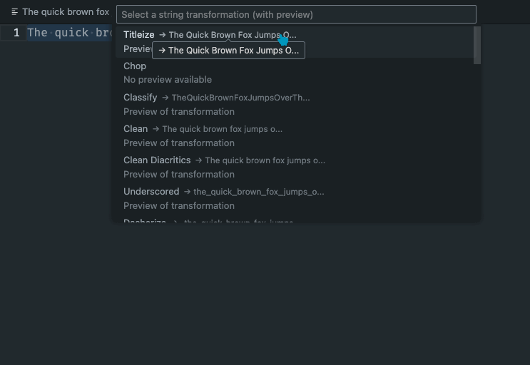

# String Manipulation for VSCode

This extension provides string manipulation commands for any selected text as well
as multiple selections.

Current string functions available:

1. camelize - converts hyphenated strings to camelCase
1. capitalize - capitalizes the first character of each selection
1. classify - converts underscored text to PascalCase
1. chop - splits into groups provided n # of characters
1. clean - collapses multiple spaces into one
1. clean diacritics - removes diacritic marks from characters
1. dasherize - converts camelCase to kebab-case
1. decapitalize - lowercases the first character of each selection
1. humanize - converts text to human-readable form
1. reverse - reverses the characters in the selection
1. screaming snake - converts text to SCREAMING_SNAKE_CASE
1. sentence - transforms text to sentence case
1. slugify - converts text to a URL-friendly slug
1. snake - converts text to snake_case
1. swap case - inverts the case of each character
1. titleize - capitalizes the first letter of each word
1. titleize (AP Style) - capitalizes titles according to AP style
1. titleize (Chicago Style) - capitalizes titles according to Chicago style
1. truncate - trims string to n # of characters and appends ellipsis
1. prune - truncate but keeps ellipsis within character count provided
1. repeat - repeat selection n # of times
1. random case - randomly changes the case of characters
1. swap quotes - swaps between single and double quotes
1. utf8ToChar - converts Unicode escapes to characters
1. charToUtf8 - converts characters to Unicode escapes

Number related functions:

1. increment - increases all numbers in the selection by 1
1. decrement - decreases all numbers in the selection by 1
1. duplicate and increment - duplicates selection and increments all numbers
1. duplicate and decrement - duplicates selection and decrements all numbers
1. sequence - replaces numbers with a sequence starting from the first number
1. incrementFloat - increases all floating point numbers in the selection by 1
1. decrementFloat - decreases all floating point numbers in the selection by 1

Additional utility commands:

1. repeat last action - repeats the last string manipulation command that was executed

## Use

To use these commands, press ⌘+p and enter any of the commands above while text is selected in your editor.

## Preview Transformations

The extension now includes a powerful preview feature that allows you to see how each transformation will affect your text before applying it.

### How to Use the Preview Feature

1. Select the text you want to transform
2. Right-click to open the context menu
3. Choose "Show Transformations with Preview"
4. Browse through the available transformations with instant previews
5. Select a transformation to apply it to your text

This feature makes it easier to find the right transformation without trial and error.

## 🧪 Introducing Labs Features

Introducing String Manipulation Labs

We're excited to announce the launch of String Manipulation Labs—a collection of (really just one at this moment) experimental features designed to enhance and expand the capabilities of the String Manipulation extension. Labs features are disabled by default to ensure a stable experience with the core functionalities.

### 🚀 How to Enable Labs Features

To try out the new Labs features, follow these simple steps:

	1.	Open VSCode Settings:
	•	Press Ctrl + , (Windows/Linux) or Cmd + , (macOS), or navigate to File > Preferences > Settings.
	2.	Search for Labs Settings:
	•	In the search bar, type stringManipulation.labs.
	3.	Enable Labs Features:
	•	Toggle the String Manipulation Labs setting to On.

### 🛠️ We Value Your Feedback

Since Labs features are experimental, your feedback is invaluable! Let us know your thoughts, report any issues, or suggest improvements to help us refine these tools.

Thank you for using String Manipulation!
Your support helps us build better tools for the community.

