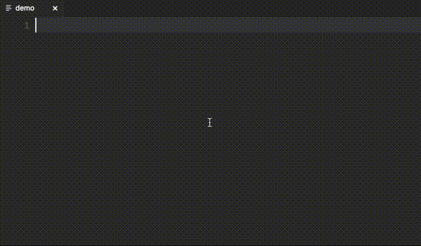

# String Manipulation for VSCode

This extension provides string manipulation commands for any selected text as well
as multiple selections.

Current string functions available:

1. camelize
1. capitalize
1. classify
1. chop - split into groups provided n # of characters
1. clean
1. clean diacritics
1. dasherize
1. decapitalize
1. humanize
1. reverse
1. screaming snake
1. sentence
1. slugify
1. snake
1. underscore
1. swap case
1. titleize
1. titleize (AP Style)
1. titleize (Chicago Style)
1. truncate - trims string to n # of characters and appends ellipsis
1. prune - truncate but keeps ellipsis within character count provided
1. repeat - repeat selection n #of times

Number related functions:

1. increment all numbers in selection
1. decrement all numbers in selection
1. duplicate selection and increment all number
1. duplicate selection and decrement all number
1. sequence all numbers in selection from first number

## Use

To use these commands, press ⌘+p and enter any of the commands above while text is selected in your editor.

## License

The MIT License (MIT)

Copyright (c) 2016 Marc Lipovsky

Permission is hereby granted, free of charge, to any person obtaining a copy
of this software and associated documentation files (the "Software"), to deal
in the Software without restriction, including without limitation the rights
to use, copy, modify, merge, publish, distribute, sublicense, and/or sell
copies of the Software, and to permit persons to whom the Software is
furnished to do so, subject to the following conditions:

The above copyright notice and this permission notice shall be included in all
copies or substantial portions of the Software.

THE SOFTWARE IS PROVIDED "AS IS", WITHOUT WARRANTY OF ANY KIND, EXPRESS OR
IMPLIED, INCLUDING BUT NOT LIMITED TO THE WARRANTIES OF MERCHANTABILITY,
FITNESS FOR A PARTICULAR PURPOSE AND NONINFRINGEMENT. IN NO EVENT SHALL THE
AUTHORS OR COPYRIGHT HOLDERS BE LIABLE FOR ANY CLAIM, DAMAGES OR OTHER
LIABILITY, WHETHER IN AN ACTION OF CONTRACT, TORT OR OTHERWISE, ARISING FROM,
OUT OF OR IN CONNECTION WITH THE SOFTWARE OR THE USE OR OTHER DEALINGS IN THE
SOFTWARE.
